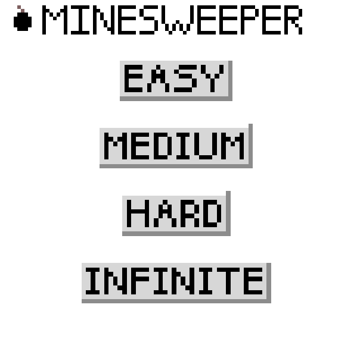
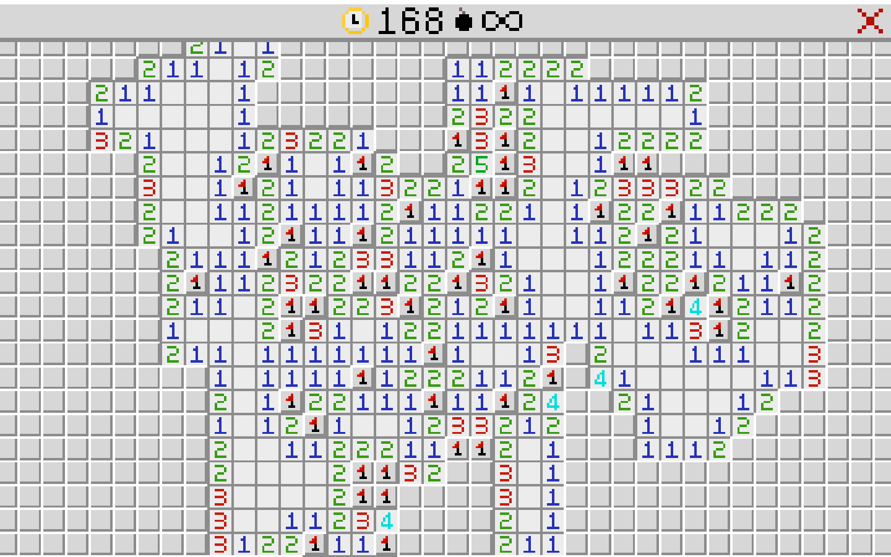

## Minesweeper

A very overcomplicated minesweeper clone. The backend is implemented entirely in 
Go, with a [pixel](https://github.com/faiface/pixel) and a web frontend. The
pixel frontend is very simplistic and exists purely for debugging purposes (for 
now). The web frontend is much more sophisticated, there are menus to select 
difficulties, and the controls work with both a mouse and touchscreen

Take a look at the web version for yourself [here](https://bhollier.github.io/minesweeper/index.html) 
(and the staging version [here](https://bhollier.github.io/minesweeper/stage/index.html))

| Main Menu                                   | Gameplay                                                                     |
|---------------------------------------------|------------------------------------------------------------------------------|
|  |  |


### Running in a window

Execute the following command in the root of the repo to build and run the pixel
frontend:

```shell
go run cmd/pixel/main.go
```

This creates a game with "intermediate" difficulty (16 x 16, 40 mines). The
program needs to be restarted (closed and rerun) if the user wins or loses
a game. Uses standard minesweeper controls (lmb to uncover a tile, rmb to place a 
flag)

### Running in a browser

Firstly, to build the WASM module, run the following command in the root of the 
repo:

```shell
GOOS=js GOARCH=wasm go build -o ./web/wasm/app.wasm cmd/web/main.go
```

The frontend uses NPM and webpack, so install and start:

```shell
npm install
npm start
```

This should install the dependencies and serve the webpack in development mode. 
If any files are changed the bundle should be recompiled automatically.

#### tinygo

Currently, building the WASM module with `go` creates a file that is ~2MB. This 
can be reduced down to ~150KB by compiling with [tinygo](https://tinygo.org/):

```shell
tinygo -o ./web/wasm/app.wasm -target wasm --no-debug cmd/web/main.go
```

The `wasm_exec.js` file in ./web/vendor also needs to be replaced with the tinygo
version. On debian systems, this can be done with the following command:

```shell
cp /usr/local/lib/tinygo/targets/wasm_exec.js ./web/vendor/wasm_exec.js
```

### Todo list:
- Proper pixel frontend
- Custom difficulty
- Peer-to-peer multiplayer?
- Extra cosmetic improvements:
  - Display elapsed time in success/retry modal
- Optimisations:
  - Populate the minefield faster using a proper shuffle